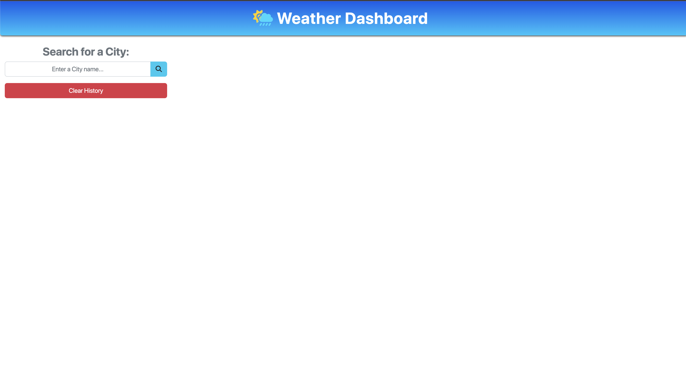
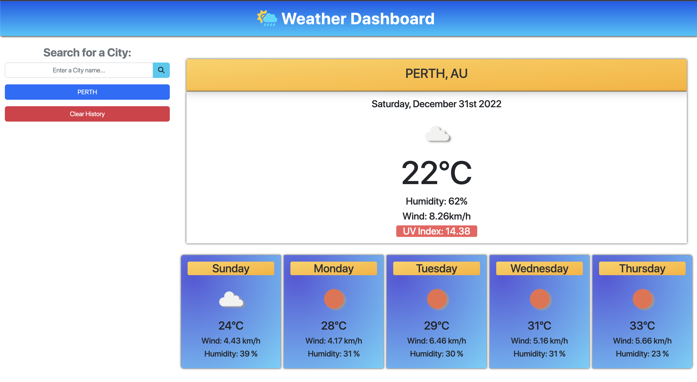

# Weather-Dashboard


## Description

#

The weather dashboard that fetches data from the OpenWeatherMap API to dynamically update an HTML and CSS. This application is design to show the current weather forecast and 5 next days weather forecast indicating the temperature, humidity and wind speed.

## Output:

## Landing Page



## Search Result Page



## Table of Contents

#

- [Installation](#installation)
- [Usage](#usage)
- [Links](#links)
- [License](#license)
- [Contributing](#contributing)
- [Tests](#tests)
- [Questions](#questions)

## Installation

#

Download or Clone this project from the repository from GitHub repository link provided in the links section below and download Node. And download Node.js and Express.js.

## Usage

#

- To run the application, Open the page link provided on the link section below. Then a Landing page will open where you will see the search bar to enter a city name and search icon button on the right of the search bar.
- Type a city name you want to search and click on the search icon button. The current Weather will be displayed on the page and also the 5 days ahead weather forecast will be displayed below.
- With this app you will be able to clear your search history by clicking the Clear History button on the left side of the page.

## Links

#

Below is the link related to the Project:

- GitHub repository - [Click Here](https://github.com/rochak-ms/weather-dashboard)
- Deployed Application - [Click Here](https://rochak-ms.github.io/weather-dashboard/)

## License

#


Please visit [Here](https://mit-license.org/) for detail information.

## Contributing

#

Please contribute to this project. Submit a bugs and feature request in issues section of the project repository in GitHub.

## Tests

```
none
```

## Questions

#

If you have any questions about the project, please contact me at rochak.ms@gmail.com. Or you can find me [Here](https://github.com/rochak-ms) on GitHub.
